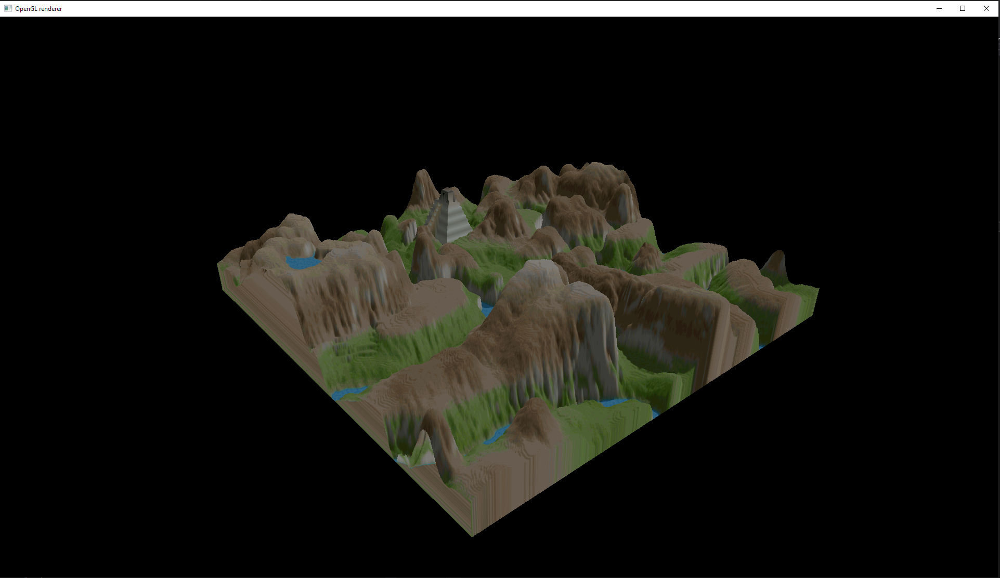

#2Dto3D
2Dto3D is an OpenGL program that renders 3D map from a given 2D texutre map and 2D height map.

Developed mainly with Windows in mind (32 bit). In the future I will try to make this program more cross-platform.

Compiled with Visual Studio 2019 (Platform Toolset v142).

I'm planning to make installation guide Soon™

Dependencies:
pre-compiled (.lib) - place in dependencies32/
- GLFW (https://www.glfw.org/)
- GLEW (http://glew.sourceforge.net/)

header libraries - place in 2dto3d/src/offsite/
- CImg (https://cimg.eu/)
	(with ImageMagick legacy tools - planning to change it to something different)

- GLM (https://github.com/g-truc/glm/)

Example screenshot:

